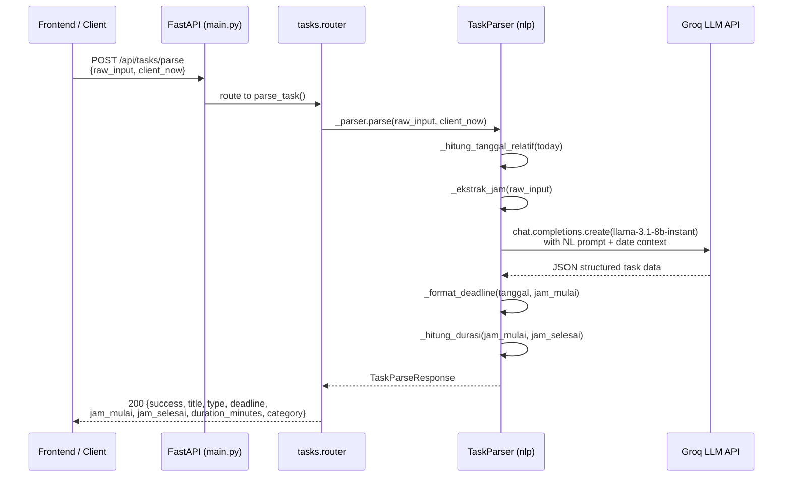
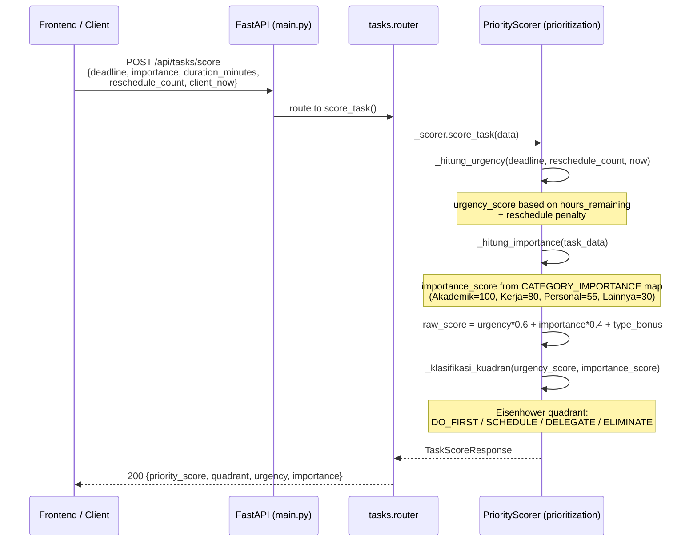
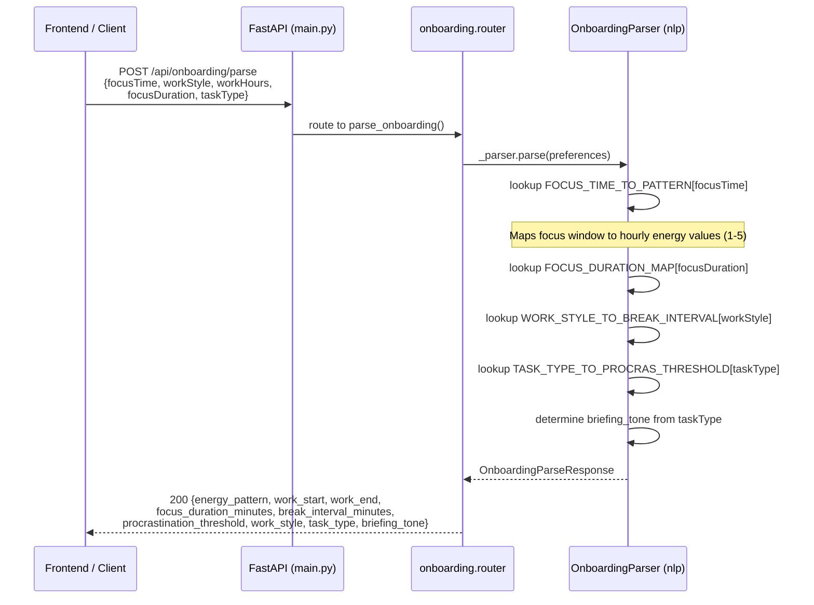
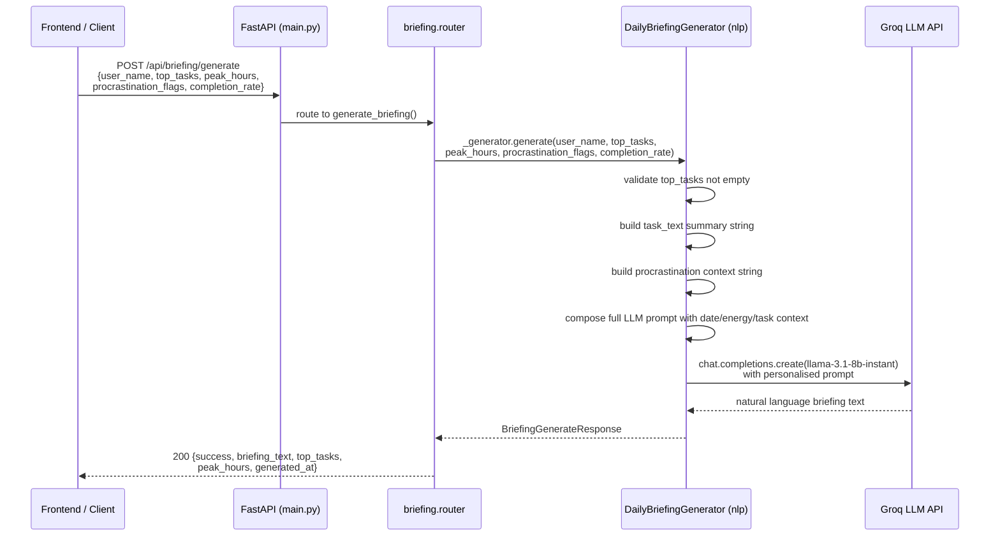
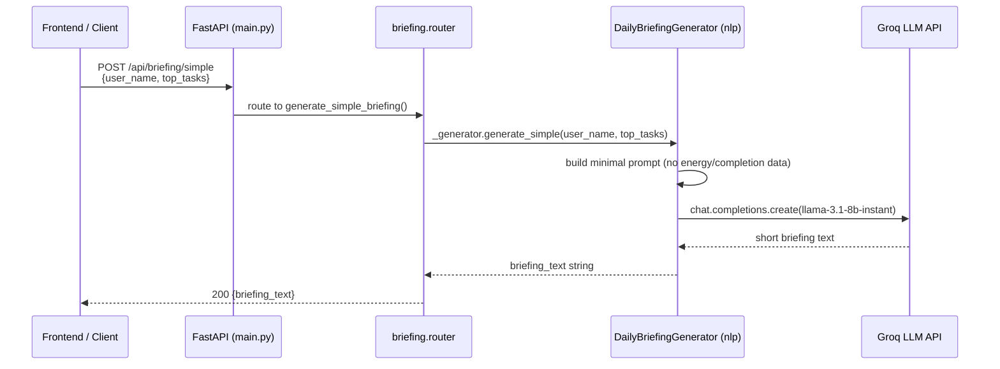

# Backend Sequence Diagrams

## 1. Task Parse Flow

```mermaid
sequenceDiagram
    participant Client as Frontend / Client
    participant API as FastAPI (main.py)
    participant Router as tasks.router
    participant Parser as TaskParser (nlp)
    participant Groq as Groq LLM API

    Client->>API: POST /api/tasks/parse<br/>{raw_input, client_now}
    API->>Router: route to parse_task()
    Router->>Parser: _parser.parse(raw_input, client_now)
    Parser->>Parser: _hitung_tanggal_relatif(today)
    Parser->>Parser: _ekstrak_jam(raw_input)
    Parser->>Groq: chat.completions.create(llama-3.1-8b-instant)<br/>with NL prompt + date context
    Groq-->>Parser: JSON structured task data
    Parser->>Parser: _format_deadline(tanggal, jam_mulai)
    Parser->>Parser: _hitung_durasi(jam_mulai, jam_selesai)
    Parser-->>Router: TaskParseResponse
    Router-->>Client: 200 {success, title, type, deadline,<br/>jam_mulai, jam_selesai, duration_minutes, category}
```

## 2. Task Score Flow

```mermaid
sequenceDiagram
    participant Client as Frontend / Client
    participant API as FastAPI (main.py)
    participant Router as tasks.router
    participant Scorer as PriorityScorer (prioritization)

    Client->>API: POST /api/tasks/score<br/>{deadline, importance, duration_minutes,<br/>reschedule_count, client_now}
    API->>Router: route to score_task()
    Router->>Scorer: _scorer.score_task(data)
    Scorer->>Scorer: _hitung_urgency(deadline, reschedule_count, now)
    Note over Scorer: urgency_score based on hours_remaining<br/>+ reschedule penalty
    Scorer->>Scorer: _hitung_importance(task_data)
    Note over Scorer: importance_score from CATEGORY_IMPORTANCE map<br/>(Akademik=100, Kerja=80, Personal=55, Lainnya=30)
    Scorer->>Scorer: raw_score = urgency*0.6 + importance*0.4 + type_bonus
    Scorer->>Scorer: _klasifikasi_kuadran(urgency_score, importance_score)
    Note over Scorer: Eisenhower quadrant:<br/>DO_FIRST / SCHEDULE / DELEGATE / ELIMINATE
    Scorer-->>Router: TaskScoreResponse
    Router-->>Client: 200 {priority_score, quadrant, urgency, importance}
```

## 3. Onboarding Parse Flow

```mermaid
sequenceDiagram
    participant Client as Frontend / Client
    participant API as FastAPI (main.py)
    participant Router as onboarding.router
    participant Parser as OnboardingParser (nlp)

    Client->>API: POST /api/onboarding/parse<br/>{focusTime, workStyle, workHours,<br/>focusDuration, taskType}
    API->>Router: route to parse_onboarding()
    Router->>Parser: _parser.parse(preferences)
    Parser->>Parser: lookup FOCUS_TIME_TO_PATTERN[focusTime]
    Note over Parser: Maps focus window to hourly energy values (1-5)
    Parser->>Parser: lookup FOCUS_DURATION_MAP[focusDuration]
    Parser->>Parser: lookup WORK_STYLE_TO_BREAK_INTERVAL[workStyle]
    Parser->>Parser: lookup TASK_TYPE_TO_PROCRAS_THRESHOLD[taskType]
    Parser->>Parser: determine briefing_tone from taskType
    Parser-->>Router: OnboardingParseResponse
    Router-->>Client: 200 {energy_pattern, work_start, work_end,<br/>focus_duration_minutes, break_interval_minutes,<br/>procrastination_threshold, work_style, task_type, briefing_tone}
```

## 4. Daily Briefing Generate Flow

```mermaid
sequenceDiagram
    participant Client as Frontend / Client
    participant API as FastAPI (main.py)
    participant Router as briefing.router
    participant Generator as DailyBriefingGenerator (nlp)
    participant Groq as Groq LLM API

    Client->>API: POST /api/briefing/generate<br/>{user_name, top_tasks, peak_hours,<br/>procrastination_flags, completion_rate}
    API->>Router: route to generate_briefing()
    Router->>Generator: _generator.generate(user_name, top_tasks,<br/>peak_hours, procrastination_flags, completion_rate)
    Generator->>Generator: validate top_tasks not empty
    Generator->>Generator: build task_text summary string
    Generator->>Generator: build procrastination context string
    Generator->>Generator: compose full LLM prompt with date/energy/task context
    Generator->>Groq: chat.completions.create(llama-3.1-8b-instant)<br/>with personalised prompt
    Groq-->>Generator: natural language briefing text
    Generator-->>Router: BriefingGenerateResponse
    Router-->>Client: 200 {success, briefing_text, top_tasks,<br/>peak_hours, generated_at}
```

## 5. Simple Briefing Flow

```mermaid
sequenceDiagram
    participant Client as Frontend / Client
    participant API as FastAPI (main.py)
    participant Router as briefing.router
    participant Generator as DailyBriefingGenerator (nlp)
    participant Groq as Groq LLM API

    Client->>API: POST /api/briefing/simple<br/>{user_name, top_tasks}
    API->>Router: route to generate_simple_briefing()
    Router->>Generator: _generator.generate_simple(user_name, top_tasks)
    Generator->>Generator: build minimal prompt (no energy/completion data)
    Generator->>Groq: chat.completions.create(llama-3.1-8b-instant)
    Groq-->>Generator: short briefing text
    Generator-->>Router: briefing_text string
    Router-->>Client: 200 {briefing_text}
```
