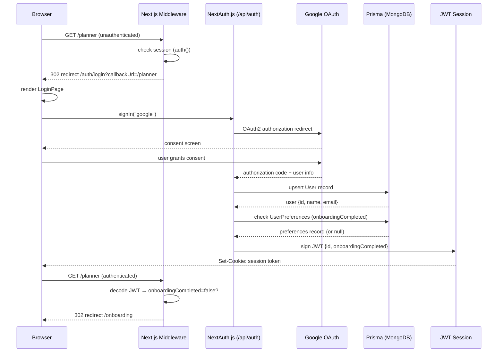
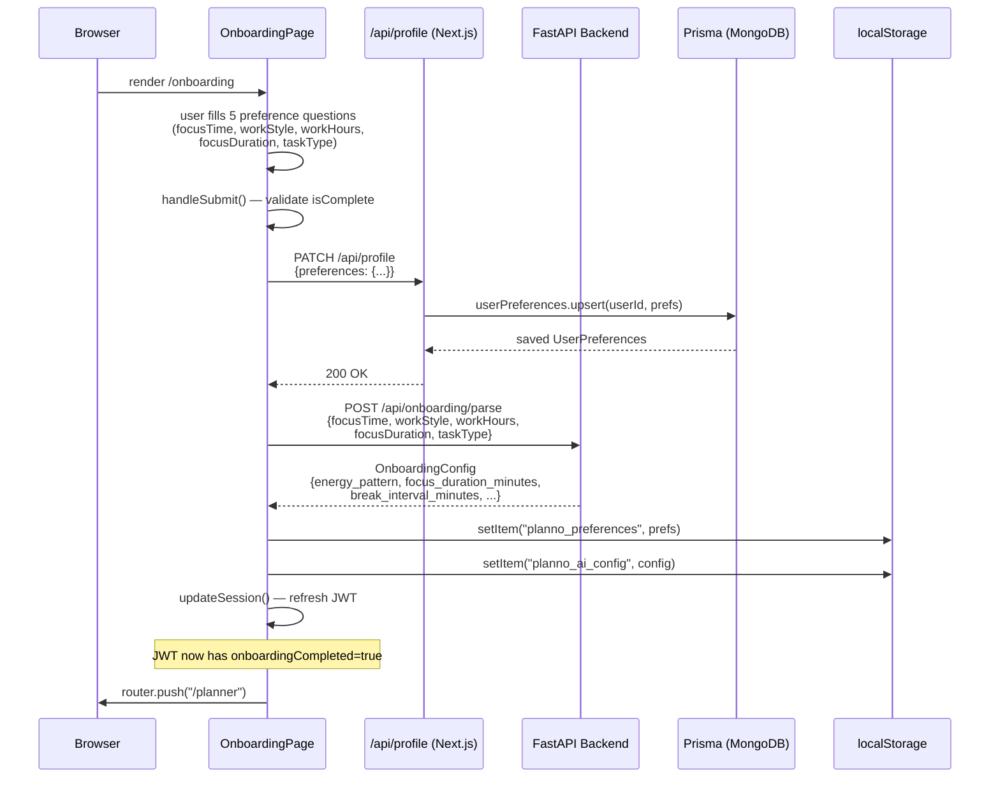
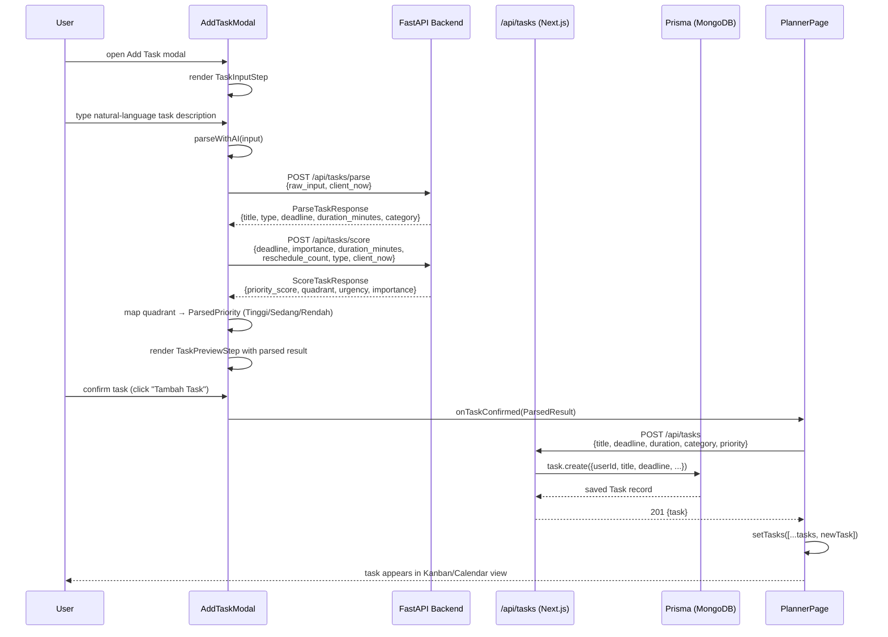
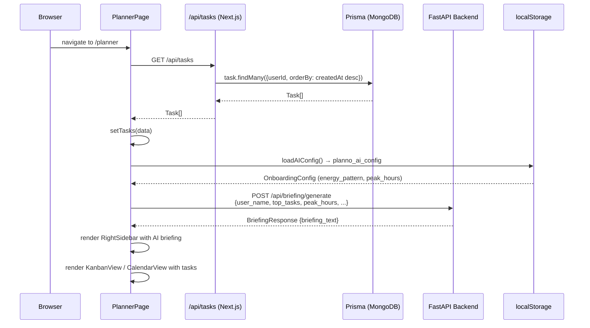
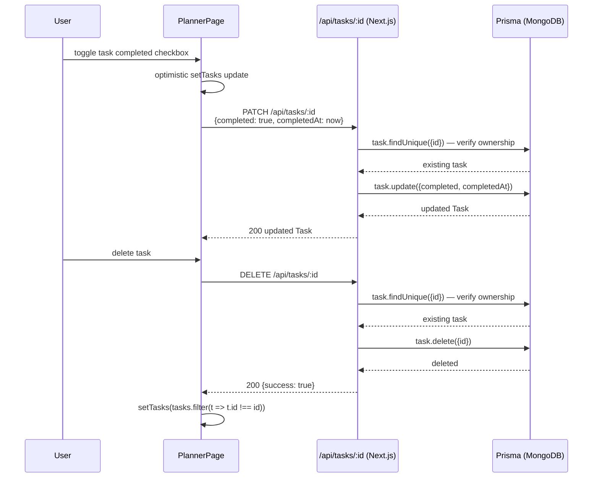
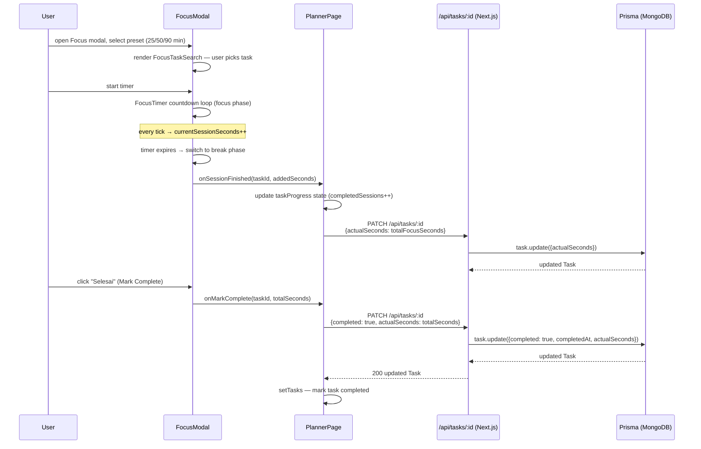
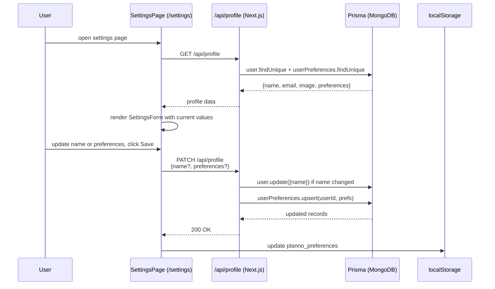

# Frontend Sequence Diagrams

## 1. Authentication Flow (Google OAuth)

## 2. Onboarding Flow

## 3. Add Task Flow (AI Parse + Score)

## 4. Planner Page Load Flow

## 5. Task Update / Delete Flow

## 6. Focus Session Flow

## 7. Settings / Profile Update Flow

