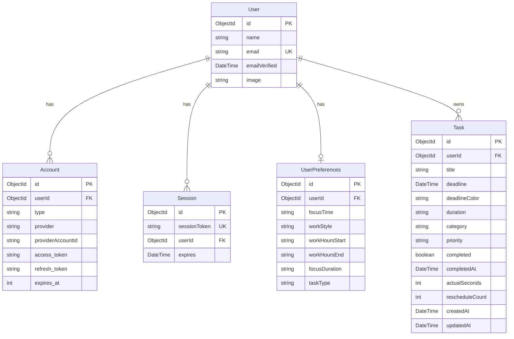
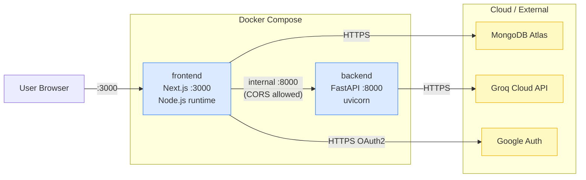

# Planno System Architecture Diagram

## System Overview

```mermaid
graph TB
    subgraph Client["Client (Browser)"]
        direction TB
        UI_Login["Login Page\n/auth/login"]
        UI_Onboarding["Onboarding Page\n/onboarding"]
        UI_Planner["Planner Page\n/planner"]
        UI_Settings["Settings Page\n/settings"]
        LS["localStorage\nplanno_preferences\nplanno_ai_config"]
    end

    subgraph Frontend["Next.js Frontend (Port 3000)"]
        direction TB
        MW["Middleware\nAuth Guard +\nOnboarding Check"]

        subgraph NextAPI["API Routes (Next.js)"]
            NA_Auth["[...nextauth]\n/api/auth"]
            NA_Tasks["Tasks API\n/api/tasks\n/api/tasks/:id"]
            NA_Profile["Profile API\n/api/profile"]
        end

        subgraph Components["React Components"]
            C_Navbar["Navbar"]
            C_AddTask["AddTaskModal\n(TaskInputStep +\nTaskPreviewStep)"]
            C_Kanban["KanbanView"]
            C_Calendar["CalendarView"]
            C_Sidebar["RightSidebar\n(AI Briefing)"]
            C_Focus["FocusModal\n(FocusTimer)"]
        end

        Prisma_Client["Prisma Client"]
    end

    subgraph Backend["FastAPI Backend (Port 8000)"]
        direction TB
        BE_Main["main.py\nFastAPI app\nCORS middleware"]

        subgraph Routers["API Routers"]
            R_Tasks["tasks.router\n/api/tasks/parse\n/api/tasks/score"]
            R_Onboarding["onboarding.router\n/api/onboarding/parse"]
            R_Briefing["briefing.router\n/api/briefing/generate\n/api/briefing/simple"]
        end

        subgraph AIEngine["AI Engine"]
            NLP_Task["TaskParser\nnlp/task_parser.py\n(Groq + regex)"]
            NLP_Onboarding["OnboardingParser\nnlp/onboarding_parser.py\n(rule-based)"]
            NLP_Briefing["DailyBriefingGenerator\nnlp/daily_briefing.py\n(Groq)"]
            Priority["PriorityScorer\nprioritization/priority_scorer.py\n(rule-based Eisenhower)"]
        end
    end

    subgraph ExternalServices["External Services"]
        Google_OAuth["Google OAuth 2.0"]
        Groq_API["Groq LLM API\nllama-3.1-8b-instant"]
        MongoDB["MongoDB Atlas\n(Database)"]
    end

    %% Client ↔ Middleware
    Client -->|"HTTP requests"| MW
    MW -->|"auth guard\nonboarding redirect"| Client

    %% Client ↔ Next.js API
    UI_Planner -->|"fetch /api/tasks"| NA_Tasks
    UI_Planner -->|"AI calls via lib/api.ts"| Backend
    UI_Onboarding -->|"PATCH /api/profile"| NA_Profile
    UI_Onboarding -->|"POST /api/onboarding/parse"| Backend
    UI_Settings -->|"GET/PATCH /api/profile"| NA_Profile
    C_AddTask -->|"POST /api/tasks/parse\nPOST /api/tasks/score"| Backend
    C_Sidebar -->|"POST /api/briefing/generate"| Backend

    %% Next.js API ↔ Prisma ↔ MongoDB
    NA_Tasks <-->|"Prisma queries"| Prisma_Client
    NA_Profile <-->|"Prisma queries"| Prisma_Client
    NA_Auth <-->|"Prisma adapter"| Prisma_Client
    Prisma_Client <-->|"MongoDB wire protocol"| MongoDB

    %% Auth flow
    NA_Auth <-->|"OAuth2 code exchange"| Google_OAuth
    MW -->|"JWT decode (edge)"| NA_Auth

    %% Backend routing
    BE_Main --> R_Tasks
    BE_Main --> R_Onboarding
    BE_Main --> R_Briefing

    R_Tasks --> NLP_Task
    R_Tasks --> Priority
    R_Onboarding --> NLP_Onboarding
    R_Briefing --> NLP_Briefing

    %% AI Engine ↔ Groq
    NLP_Task <-->|"chat.completions\nllama-3.1-8b-instant"| Groq_API
    NLP_Briefing <-->|"chat.completions\nllama-3.1-8b-instant"| Groq_API

    %% localStorage
    UI_Onboarding -->|"write config"| LS
    C_Sidebar -->|"read ai_config"| LS

    %% Styles
    classDef frontendStyle fill:#dbeafe,stroke:#3b82f6,color:#1e3a5f
    classDef backendStyle fill:#dcfce7,stroke:#22c55e,color:#14532d
    classDef externalStyle fill:#fef9c3,stroke:#eab308,color:#713f12
    classDef clientStyle fill:#f3e8ff,stroke:#a855f7,color:#3b0764

    class Frontend,NextAPI,Components,Prisma_Client frontendStyle
    class Backend,Routers,AIEngine backendStyle
    class ExternalServices,Google_OAuth,Groq_API,MongoDB externalStyle
    class Client,UI_Login,UI_Onboarding,UI_Planner,UI_Settings,LS clientStyle
```

## Data Model

```mermaid
erDiagram
    User {
        ObjectId id PK
        string name
        string email UK
        DateTime emailVerified
        string image
    }
    Account {
        ObjectId id PK
        ObjectId userId FK
        string type
        string provider
        string providerAccountId
        string access_token
        string refresh_token
        int expires_at
    }
    Session {
        ObjectId id PK
        string sessionToken UK
        ObjectId userId FK
        DateTime expires
    }
    UserPreferences {
        ObjectId id PK
        ObjectId userId FK
        string focusTime
        string workStyle
        string workHoursStart
        string workHoursEnd
        string focusDuration
        string taskType
    }
    Task {
        ObjectId id PK
        ObjectId userId FK
        string title
        DateTime deadline
        string deadlineColor
        string duration
        string category
        string priority
        boolean completed
        DateTime completedAt
        int actualSeconds
        int rescheduleCount
        DateTime createdAt
        DateTime updatedAt
    }

    User ||--o{ Account : "has"
    User ||--o{ Session : "has"
    User ||--o| UserPreferences : "has"
    User ||--o{ Task : "owns"
```

## Deployment Architecture

```mermaid
graph LR
    subgraph Docker["Docker Compose"]
        FE_Container["frontend\nNext.js :3000\nNode.js runtime"]
        BE_Container["backend\nFastAPI :8000\nuvicorn"]
    end

    subgraph Cloud["Cloud / External"]
        MongoDB_Atlas["MongoDB Atlas"]
        Groq_Cloud["Groq Cloud API"]
        Google_Auth["Google Auth"]
    end

    Browser["User Browser"] -->|":3000"| FE_Container
    FE_Container -->|"internal :8000\n(CORS allowed)"| BE_Container
    FE_Container -->|"HTTPS"| MongoDB_Atlas
    FE_Container -->|"HTTPS OAuth2"| Google_Auth
    BE_Container -->|"HTTPS"| Groq_Cloud

    classDef container fill:#dbeafe,stroke:#3b82f6
    classDef cloud fill:#fef9c3,stroke:#eab308
    class FE_Container,BE_Container container
    class MongoDB_Atlas,Groq_Cloud,Google_Auth cloud
```
